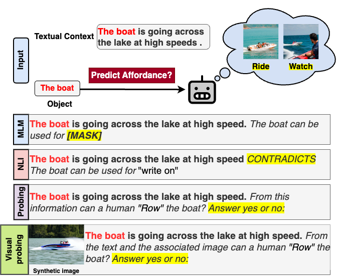

# 🧠 Text2Afford: Probing Object Affordance Prediction Abilities of Language Models Solely from Text (CONLL 2025)

<div align="center">
  
  <p>*Overview of the Text2Afford framework and its evaluation pipeline.*</p>
</div>

---

## 📚 Abstract

Understanding object affordances—what actions objects enable—is crucial for AI systems to interact effectively with the physical world. While vision-based models have made strides in this area, the capability of language models (LMs) to infer affordances purely from text remains underexplored.

**Text2Afford** introduces a comprehensive, crowdsourced dataset annotated with 15 affordance classes across diverse, in-the-wild sentences. Our study evaluates both pre-trained language models (PTLMs) and vision-language models (VLMs) on their ability to predict object affordances from textual context alone. Findings reveal that:

- PTLMs struggle with uncommon or context-dependent affordances.
- VLMs do not consistently capture affordance information effectively.
- Few-shot fine-tuning enhances affordance prediction capabilities in both PTLMs and VLMs.

This work underscores the challenges and potential pathways for grounding language models in physical reasoning tasks.

*For a detailed exploration, refer to our [arXiv paper](https://arxiv.org/abs/2402.12881).*

---

## 📰 Publication

- **Conference**: [CoNLL 2024](https://conll.org/2024-accepted-papers)
- **Paper**: [TEXT2AFFORD: Probing Object Affordance Prediction Abilities of Language Models Solely from Text](https://arxiv.org/abs/2402.12881)
- **Authors**: Sayantan Adak, Daivik Agrawal, Animesh Mukherjee, Somak Aditya

---

## 📂 Repository Overview

This repository encompasses:

- **Dataset**: A curated collection of sentences annotated with object-affordance pairs across 15 classes.
- **Codebase**: Scripts for data preprocessing, model training, evaluation, and analysis.
- **Experiments**: Benchmarks using models like BERT, RoBERTa, BART, FLAN-T5, ChatGPT, CLIP, and LLaVA.

---

## 🛠️ Getting Started

### Prerequisites

- Python 3.8+
- PyTorch
- Transformers
- Additional dependencies listed in `requirements.txt`

### Installation

```bash
git clone https://github.com/sayantan11995/Text2Afford.git
cd Text2Afford
pip install -r requirements.txt
```

### Usage


#### Evaluation on Text2Afford dataset

```bash
python src/<method>.py 
```

---

## 📁 Dataset Details

- **Total Samples**: 35,520 sentence-object-affordance tuples
- **Affordance Classes**: 15 (e.g., *grasp*, *sitOn*, *ride*)
- **Annotations**: Crowdsourced with high inter-annotator agreement
- **Format**: TSV with columns for sentence, object, and affordance labels

---

## 🤝 Contributing

We welcome contributions! 

---

## 📄 License

This project is licensed under the MIT License. See the [LICENSE](LICENSE) file for details.

---

## 📬 Contact

For questions or collaborations:

- **Sayantan Adak**: [sayantanadak@kgpian.iitkgp.ac.in](mailto:sayantanadak@kgpian.iitkgp.ac.in)

---

*Empowering language models with physical reasoning capabilities through textual affordance understanding.*

## 📌 Citation

If you use this work, please cite our paper:

```bibtex
@inproceedings{adak-etal-2024-text2afford,
    title = "{T}ext2{A}fford: Probing Object Affordance Prediction abilities of Language Models solely from Text",
    author = "Adak, Sayantan  and
      Agrawal, Daivik  and
      Mukherjee, Animesh  and
      Aditya, Somak",
    editor = "Barak, Libby  and
      Alikhani, Malihe",
    booktitle = "Proceedings of the 28th Conference on Computational Natural Language Learning",
    month = nov,
    year = "2024",
    address = "Miami, FL, USA",
    publisher = "Association for Computational Linguistics",
    url = "https://aclanthology.org/2024.conll-1.27/",
    doi = "10.18653/v1/2024.conll-1.27",
    pages = "342--364",
}


